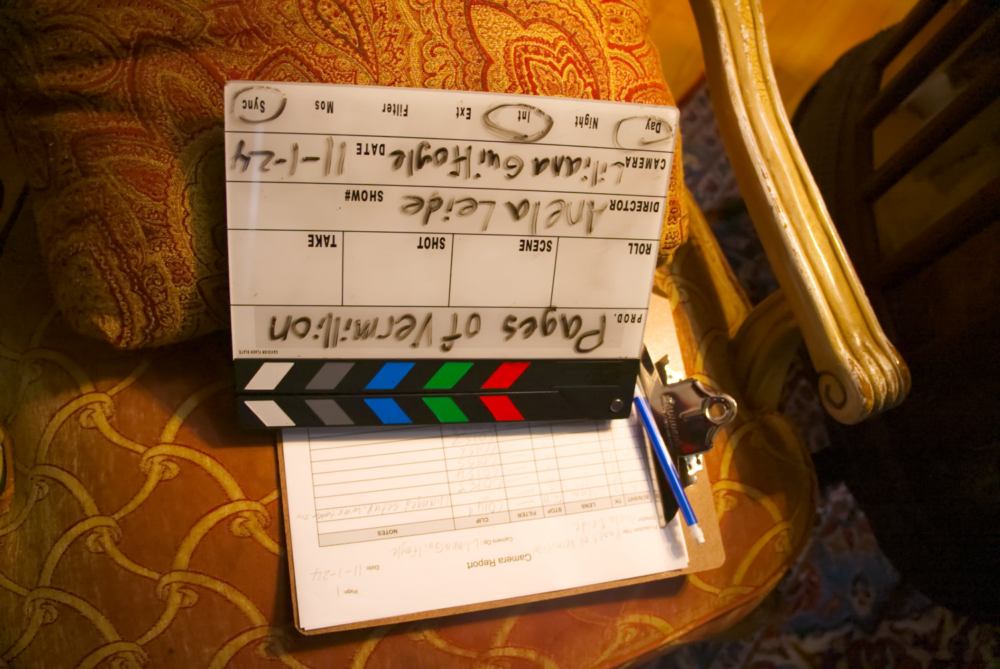
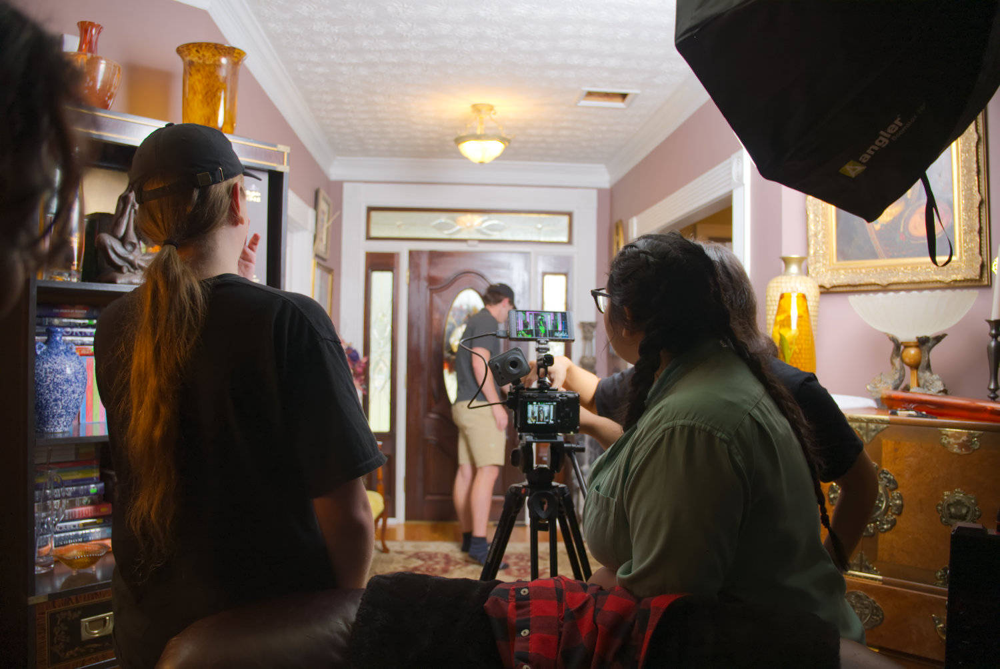
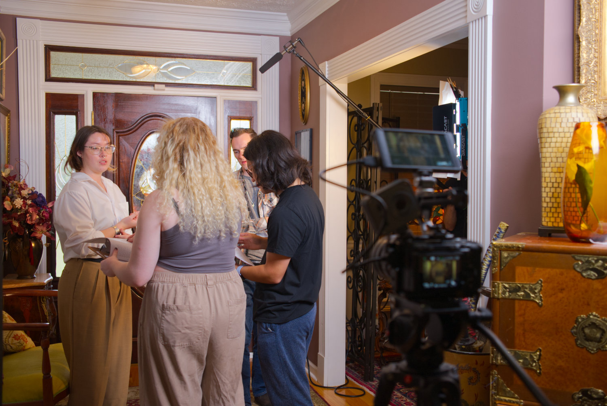

An up-and-coming murder mystery novelist, haunted by the death of her twin sister, can no longer distinguish between reality and delusion-as bodies pile up, a live interview about her upcoming memoir forces her to confront the chilling possibility that her hallucinatory inspiration may be terrifyingly real.

## Personnel

Writer, Director: Anela Leide

Producer, 1st AD, Editor: Justin Jung

Director of Photography: Liliana Guilfoyle

Production Designer: Bailey Cox

## Technical Details

Camera: Sony FX30

Lenses: Rokinon Cine DS

## Behind the Scenes

This was a project that Anela and I created for our Production Basics class in the fall of 2024. The script was adapted from an idea for a novel that Anela had, so I felt confident in the story. I think we fell short by trying to include too much—we tried to tell a novel's worth of content into just 6 pages, which I think was too much to fit in. We'd like to expand this into a longer piece so we have more room to tell the stories Anela's dreamt up.

*The slate.*

*Some of the crew members reviewing a shot. L-R: Rain Bell, William Moriarty, Liliana Guilfoyle*

*Anela and I working with the actors. L-R: Lois Brock, Anela Leide, Bryan Phillips, Justin Jung*