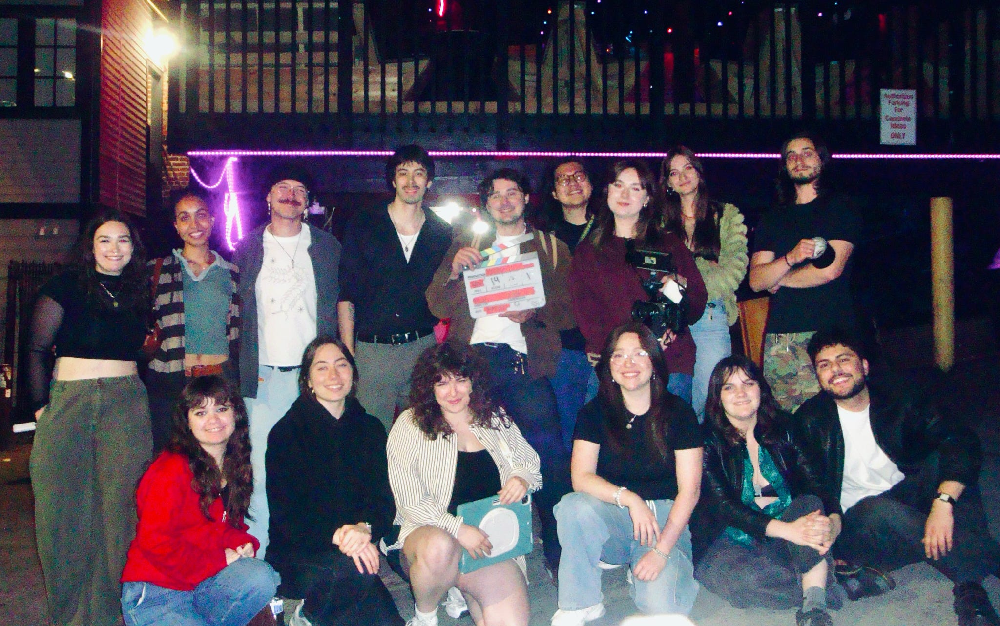
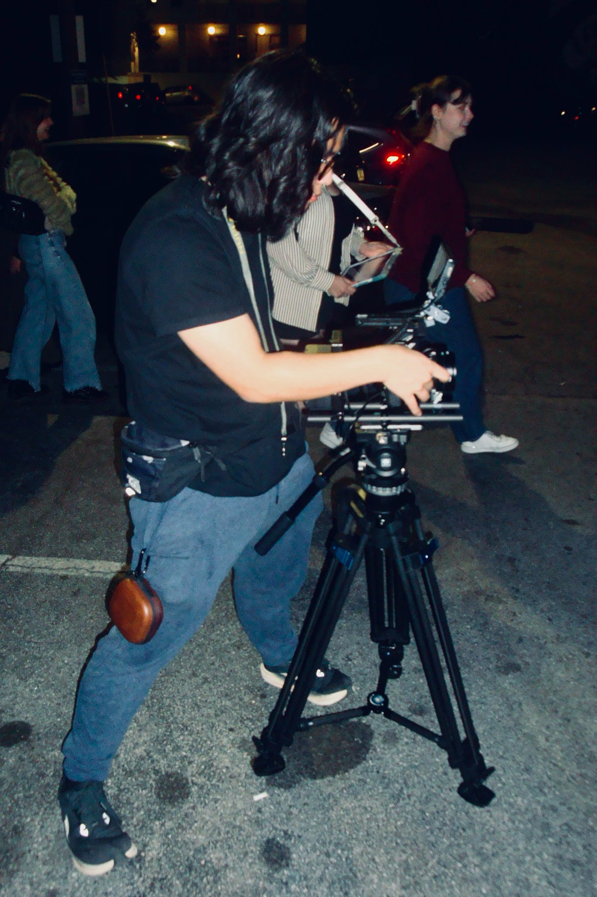
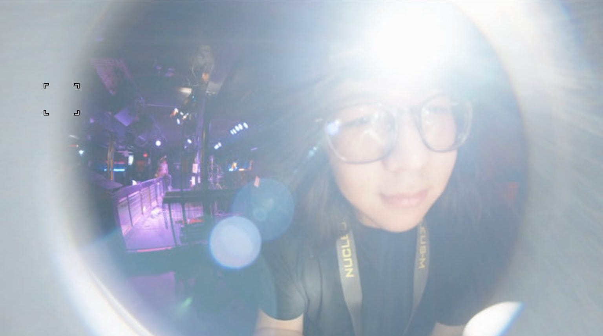

## Personnel

Director: Rebecca Levy

Producer: Sera Johnson

Director of Photography: Gabrielle Held

1st Assistant Camera: Justin Jung

## Behind the Scenes

*Written 2026/08/06*

This was a fun project to work on.

1st AC'ing this project was one of the most intense shoots I've ever worked on, in a good way. From the beginning, I knew it wasn't going to be easy; filming out and about in Atlanta, on the MARTA, and in a tight bar was going to be tough, even if we had all the time and money in the world. Having to balance the workload of pulling focus, maintaining the camera, and communicating with Gabrielle all while staying alert in public was a different kind of multitasking than I was used to. I did start to understand why all the old ACs online complain about DPs shooting "WFO," though. Pulling focus on those T1.2 Nightwalkers was **tough**.

That isn't to say it wasn't a rewarding experience—it was. I hadn't worked with Gabrielle or Rebecca in a couple of years and it was great to catch up and work creatively together. I also got to meet and work with a number of people I had heard of but never really met before. It felt like a party, except there was no alcohol and everyone was there to make art. If nothing else, this was a great excuse to hone my skills while hanging out with my friends producing *something*.

*The cast and crew.*

*Huddle before the start of the final shoot day.*

*Prepping the camera for a VFX plate outside.*

*Cleaning out the 8mm fisheye lens.*